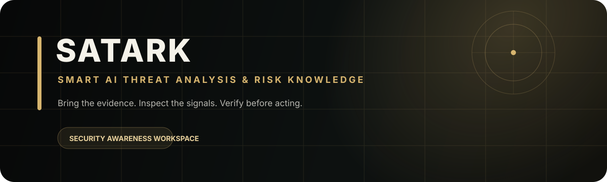

<div align="center">

# SATARK
### Smart AI Threat Analysis & Risk Knowledge

[](https://satark-32uppvjxwmderrchbhj7gj.streamlit.app/)

  
[](SECURITY.md)

**Investigate incidents. Preserve evidence. Respond with control.**

SATARK now includes **FIRSTLIGHT Incident Command** as its flagship workspace for synthetic incident investigation, evidence integrity challenges, evidence-linked timelines, and human-approved simulated response. Existing text, URL, image, QR, PDF, and video scanners remain available as secondary threat-analysis tools.

SATARK is an AI-assisted security-awareness workspace for triaging suspicious messages, links, images, QR codes, PDFs, and supported videos.

It is designed around a simple workflow: **bring the evidence → inspect the signals → review what is and is not corroborated → verify before acting.** The primary workspace prioritizes investigations; learning features remain available without competing with the core flow.


</div>

---

> **Important:** SATARK is a learning and triage aid—not an antivirus, forensic tool, or proof that content is safe. AI-generated scores are not calibrated probabilities. A suspicious item may be missed, and a legitimate item may be flagged. Independently verify consequential findings.

## Contents

- [FIRSTLIGHT Incident Command](#firstlight-incident-command)
- [What SATARK does](#what-satark-does)
- [Features](#features)
- [How it works](#how-it-works)
- [Technology](#technology)
- [Run locally](#run-locally)
- [Configure Groq](#configure-groq)
- [Project structure](#project-structure)
- [Tests and checks](#tests-and-checks)
- [Security, privacy, and limitations](#security-privacy-and-limitations)
- [Roadmap](#roadmap)
- [Contributing](#contributing)

## FIRSTLIGHT Incident Command

Open FIRSTLIGHT from the sidebar to load a repeatable fictional account-compromise scenario. The prototype provides SHA-256 evidence verification, a controlled tampering challenge, a deterministic multi-step investigation workflow, evidence-linked findings, a chronological timeline, explicit evidence gaps, approval/rejection controls for simulated response actions, a hash-chained in-session audit trail, and JSON report export. No real endpoint, account, process, or network action is performed. Read [the FIRSTLIGHT scope and safety boundaries](docs/FIRSTLIGHT.md).

## What SATARK does

SATARK provides a single workspace to examine potentially risky digital content and learn about common online scams. Depending on the selected workflow and available dependencies, it can analyze text, URLs, images/QR codes, PDFs, and videos. Results may include a threat category, risk score, confidence value, indicators, and suggested next steps.

The app also includes **Scam Challenge**, **SATARK Academy**, and **Classroom Mode** for security-awareness learning.

## Features

| Feature | Description |
| --- | --- |
| Text analysis | Review suspicious messages and other text for scam indicators. |
| URL analysis | Validate and retrieve eligible public-page text for analysis. |
| Image and QR analysis | Submit supported images and QR-code content for review. |
| PDF analysis | Extract text from supported PDF documents and analyze it. |
| Video analysis | Extract representative frames; optionally transcribe audio when the workflow and provider support it. |
| AI-assisted results | Present a model-generated assessment, indicators, and suggested actions. |
| Deterministic evidence ledger | Separately shows local pattern-based observations such as URLs, known shorteners, phone/UPI-like identifiers, urgency, credential requests, and payment language. These are review signals—not proof of fraud or safety. |
| Evidence coverage review | Flags broad AI assessments that lack independent text-rule observations, and treats visual workflows separately. It is a coverage check—not claim-by-claim verification. |
| Responsive investigation workspace | Focused navigation, a guided offline sample, mobile-aware layouts, and clear separation between evidence, AI interpretation and next steps. |
| PDF export | Download a report of an analysis. |\n| FIRSTLIGHT event import | Import bounded JSON/CSV event exports, normalize timestamps, hash the original artifact, and run explainable evidence-linked rules without sending imported data to an AI provider. |
| Session history | Revisit results held in the current app session. |
| Learning | Practice scam recognition and explore security-awareness content. |

Some workflows depend on external provider access or optional system tools. Video frame analysis uses OpenCV; video audio transcription additionally requires FFmpeg to be installed on the host. A completed analysis does not mean that a file was executed in a sandbox or exhaustively scanned.

## How it works

1. **Choose a workflow** and provide the content you want to examine.
2. **Prepare the input.** Depending on the workflow, SATARK may extract text, inspect image content, or sample video frames.
3. **Extract local signals.** For supported text inputs, SATARK records deterministic pattern matches separately from model output; this step makes no network requests and does not decide whether content is malicious.
4. **Request an AI assessment.** Supported analysis is sent to the configured Groq service.
5. **Review the result.** Inspect the evidence ledger, then the evidence-coverage review, AI interpretation and next steps. The coverage check does not validate every AI claim; treat the output as triage, not a definitive security verdict.
6. **Learn and report.** Use the learning sections or export a PDF when useful.

Do not submit passwords, one-time codes, private keys, or unnecessary personal information.

## Technology

- **Python** — application logic
- **Streamlit** — interactive web interface and session state
- **CSS** — dependency-free visual system, responsive layout, micro-interactions and reduced-motion support
- **Native Streamlit UI** — layout, navigation, learning and onboarding surfaces without a second browser runtime
- **Groq** — AI model API and supported audio transcription
  - Text workflows prefer `openai/gpt-oss-120b`, with `openai/gpt-oss-20b` as fallback when available.
  - Vision workflows use `qwen/qwen3.8-27b`, subject to the API key's available models.
- **pypdf** — PDF text extraction
- **Pillow** — image handling and conversion
- **ReportLab** — PDF report generation
- **OpenCV** — video frame extraction
- **FFmpeg** — optional audio-track extraction for video transcription

The repository separates analysis, input processing, findings, security, provider, media processing, reporting and major UI responsibilities into modules. The visual layer is CSS-first and the onboarding workflow uses native Streamlit rendering, so the core interface does not depend on a second browser runtime or a third-party JavaScript CDN. `satark.py` remains the orchestration layer, while provider, processing and UI responsibilities are extracted into focused modules.

## Run locally

### Requirements

- Python 3.10 or newer
- A Groq API key for AI-powered workflows
- Dependencies listed in `requirements.txt`

### Install

Clone the repository and enter its directory:

```bash
git clone https://github.com/kaustubhdua/Satark.git
cd Satark
python -m venv .venv
```

Activate the environment.

**Windows PowerShell**
```powershell
.venv\Scripts\Activate.ps1
```

**macOS / Linux**
```bash
source .venv/bin/activate
```

Install dependencies and start Streamlit:

```bash
python -m pip install --upgrade pip
python -m pip install -r requirements.txt
streamlit run satark.py
```

Streamlit will print a local address in the terminal. Open it in your browser.

## Configure Groq

Set `GROQ_API_KEY` in your environment before starting the app.

**Windows PowerShell**
```powershell
$env:GROQ_API_KEY="your-key"
streamlit run satark.py
```

**macOS / Linux**
```bash
export GROQ_API_KEY="your-key"
streamlit run satark.py
```

If the app offers a sidebar key field, it can also be used for local experimentation. Never commit API keys or place them in public source files. For deployments, use the hosting provider's secret manager.

## Project structure

```text
.
├── .github/
│   └── workflows/
│       └── ci.yml               # Automated validation workflow
├── docs/
│   ├── ANALYSIS_LIMITATIONS.md  # Interpretation and safe-use guidance\n│   └── FIRSTLIGHT.md           # Incident workspace scope and safety boundaries
├── tests/
│   ├── test_ai_provider.py          # Provider/model-selection tests
│   ├── test_review_engine.py        # Evidence coverage review tests
│   ├── test_reports.py              # PDF text/output regression tests
│   ├── test_url_security.py         # Safe-fetch boundary tests
│   ├── e2e_smoke.py                 # Desktop/mobile browser and PDF download checks
│   ├── test_analysis_engine.py      # Result normalization/confidence tests
│   ├── test_input_processing.py     # Upload validation tests
│   ├── test_satark_utils.py         # Shared helper tests
│   ├── test_satark_utils_urls.py    # Verification URL safety tests
│   ├── test_scam_challenge.py       # Game-engine regression tests
│   └── test_video_processing.py     # Video helper tests
├── satark.py                    # Streamlit entry point and app orchestration
├── ui/                          # Navigation, home, results, history and learning surfaces
│   ├── home.py
│   ├── navigation.py
│   ├── results.py
│   ├── history.py
│   └── learning.py
├── ai_provider.py               # Groq client and model-selection helpers
├── review_engine.py             # Deterministic evidence coverage review
├── scam_challenge.py             # Scam Challenge game and rendering
├── video_processing.py           # Video frame and audio helpers
├── reports.py                    # PDF report generation
├── satark_utils.py               # Shared text/result helpers
├── url_security.py               # URL validation and public-page fetching
├── styles.css                    # Application styles
├── radar_background.py            # CSS-only background hook
├── stepper_component.py           # Dependency-free onboarding workflow
├── requirements.txt              # Python dependencies
├── README.md
└── SECURITY.md                   # Security policy and deployment checklist
```

## Tests and checks

Install the project dependencies, then run:

```bash
python -m pip check
python -m compileall -q .
python -m unittest discover -s tests -v
```

These checks cover dependency consistency, full Python compilation, analysis normalization, URL safety, evidence coverage review, PDF content, UI contracts, provider selection, media processing, and layout/source hygiene. CI also runs desktop/mobile browser smoke checks, including the offline sample and PDF download. They do **not** replace manual testing of live Groq requests, deployment configuration, or end-to-end file processing.

GitHub Actions also runs CodeQL. A passing unit-test run alone does not establish production readiness, but the repository now has explicit automated gates for the highest-risk source and dependency regressions.

## Security, privacy, and limitations

- **Treat results as advisory.** AI can make mistakes, and attackers can adapt their content.
- **Do not interact with suspicious content** just to confirm a result. Avoid opening suspicious links or executing attachments.
- **Minimize sensitive input.** Do not submit passwords, OTPs, private keys, or data you do not need analyzed.
- **Understand external processing.** Content submitted for AI analysis may be sent to the configured provider. Review the provider's data-handling terms before using sensitive material.
- **Do not treat session history as evidence storage.** It is not a secure, durable case-management system.
- **Use deployment safeguards.** Restrict access where appropriate, keep secrets out of source control, set upload/request limits, and apply network egress controls.

See [Analysis limitations](docs/ANALYSIS_LIMITATIONS.md) and the [Security policy](SECURITY.md) for additional guidance.

## Roadmap

- [x] Move application styling into a dedicated CSS file.
- [x] Extract shared text/result helpers.
- [x] Isolate URL validation and public-page fetching.
- [x] Extract PDF report generation.
- [x] Extract Scam Challenge into its own module.
- [x] Extract video processing helpers.
- [x] Add unit tests for shared helpers and video processing.
- [x] Extract Groq client and model-selection helpers from the Streamlit entry point.
- [x] Add broader workflow and end-to-end tests.
- [x] Pin runtime dependencies and add automated CI validation.
- [x] Keep the unit-test suite aligned with the current dependency-free UI architecture.
- [x] Add a deterministic evidence-coverage review and export it with the PDF report.
- [x] Prioritize the evidence-first investigation flow in the responsive workspace.
- [x] Verify that provider model-discovery failures are not reported as successful connections.
- [x] Document the deployment security checklist and URL-fetching threat model.
- [x] Exercise all six scanner-selection states and contextual guidance in the browser smoke suite without requiring provider credentials.
- [ ] Add deployment-specific live tests for provider-backed analysis and file-processing workflows; these require configured secrets and a target-host environment.

## Contributing

Focused improvements and bug fixes are welcome. Please:

1. Keep changes small and explain their purpose.
2. Add or update tests for behavior changes.
3. Run the checks above and report what was actually verified.
4. Never commit credentials, tokens, or real sensitive user content.
5. Report security vulnerabilities privately using the process in [SECURITY.md](SECURITY.md), rather than opening a public issue.
